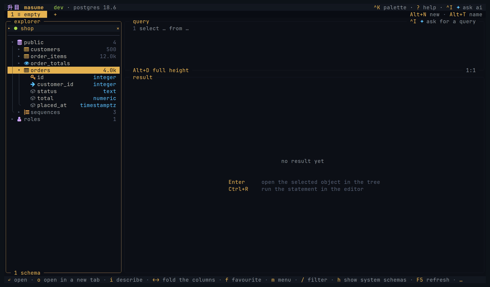
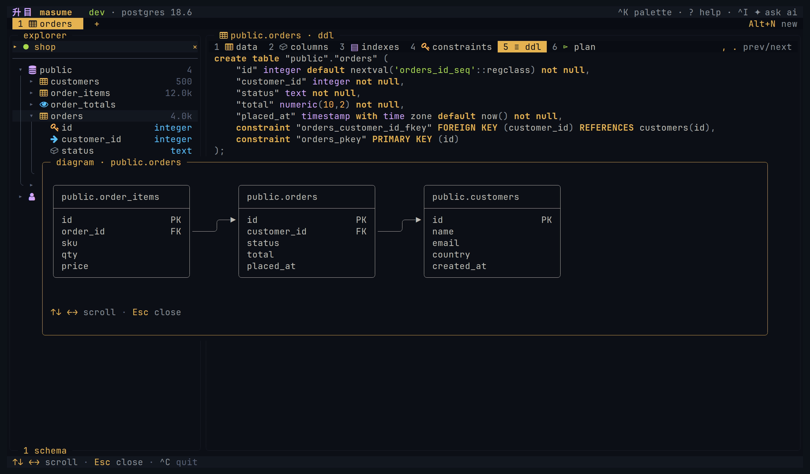
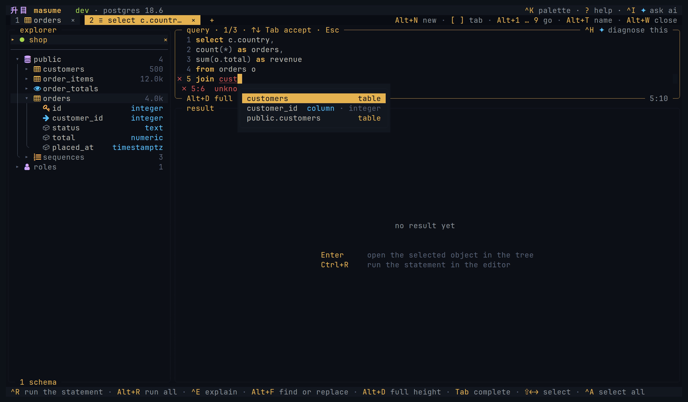
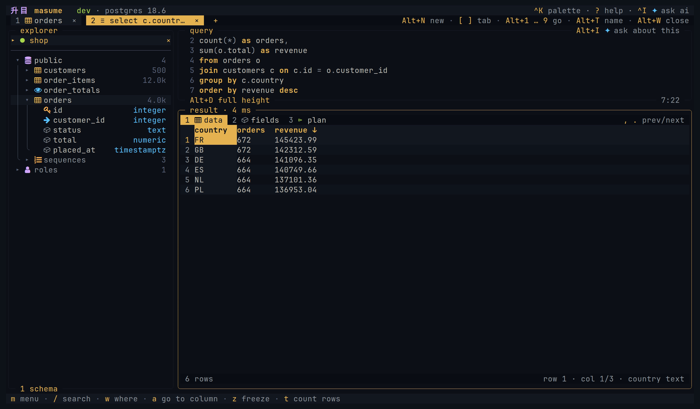
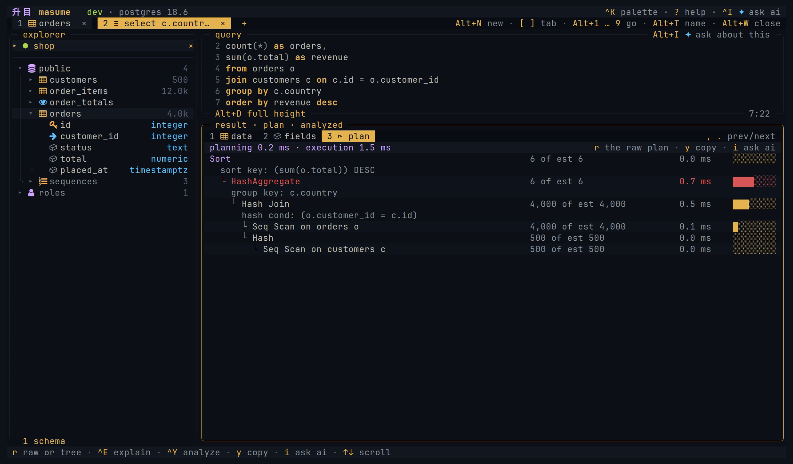

<h1 align="center">升目 masume</h1>

<h3 align="center">A database client for the terminal</h3>

<p align="center">
  <em>Browse and query a database in the terminal. Let an AI agent use the same connections.</em>
</p>

<p align="center">
  <a href="https://github.com/turanmahmudov/masume/actions/workflows/check.yml"></a>
  
  
</p>

<p align="center">
  <code>go install github.com/turanmahmudov/masume/cmd/masume@master</code>
</p>

<p align="center">
  
</p>

---

### Browse

The object tree lists schemas, tables, views, functions, sequences, types, triggers and roles. Select a table to see its data, columns, indexes, constraints, DDL and query plan.



### Diagram

An ER diagram shows a table and the tables it is linked to by foreign keys.



### Query

The editor has syntax highlighting and autocompletion based on the database catalog. Errors are marked in the gutter before you run the statement.



### Results

Sort, filter, follow a foreign key, freeze a column, or mask a column. Edits are staged in the grid. Nothing is written until you review the changes as SQL and run them.



### Explain

Query plans are displayed as a tree, with estimated or measured costs.



### Agents

masume has a built-in AI chat and an MCP server over stdio. The chat uses the current connection. `masume --mcp` connects to the profiles listed in the config. Both use the same tools with the same access limits, and both ask for confirmation before a write.

---

## Features

**Multiple engines:** PostgreSQL, MySQL, SQLite, Redis and MongoDB, plus hosted services based on them

**MCP server:** `masume --mcp` exposes selected profiles to an agent over stdio, with an access level per profile and for the whole server

**AI chat:** ask about a statement, its error, or its query plan. Supports Anthropic and OpenAI

**Autocompletion from the catalog:** table and column names are suggested as you type. Errors are marked in the gutter before the statement runs

**All table details:** data, columns, indexes, constraints, DDL, query plan, and an ER diagram

**Staged edits:** insert, edit, duplicate and delete rows. Review the changes as SQL, then run or discard them

**Filters:** filter by one value, by several values, or by a `WHERE` clause. Filters stack, and one key removes the last one

**Follow a foreign key** to the referenced row

**Query plans** as a tree with estimated or measured costs, or as raw text

**Named parameters:** a statement with `:name` placeholders opens a form for the values

**Server activity:** list the other sessions and their statements, and stop one, on engines that support it

**Redis and MongoDB:** a query tab accepts Redis commands or MongoDB shell syntax

**Export and copy:** CSV, JSON, Markdown, `INSERT` statements, one row as JSON, or one column as an `IN` clause

**Query history and saved queries.** Open tabs are restored after a restart

**Manual transactions:** disable autocommit, then begin, commit or roll back

**Read-only profiles:** the session is set read-only on the server, so writes are impossible

**Eleven built-in themes,** or use the terminal colours. When the terminal theme changes, masume updates

**AI is optional:** `[ai] enabled = false` disables all AI features and hides them from the interface

---

## Install

There is no tagged release yet, so there are no prebuilt binaries. Each command below builds the latest commit on `master`.

- **Go 1.27 or later:** `go install github.com/turanmahmudov/masume/cmd/masume@master`
- **mise:** `mise use -g "go:github.com/turanmahmudov/masume/cmd/masume@master"`

### From source

```sh
git clone https://github.com/turanmahmudov/masume.git
cd masume
mise run install
```

## Usage

```
masume                        open the client
masume run STATEMENT          run one statement, write the result, and exit
masume URL                    open one connection, for example postgres://you@host/shop
masume FILE                   open one SQLite file, for example ./notes.db
masume DSN                    open one connection string, for example "host=db dbname=shop"
masume --profile NAME         open one profile of the config file
masume --detect               list the databases running in a container on this machine
masume --mcp                  run the MCP server for the configured profiles
masume --mcp --profile=NAME   run the MCP server for one profile
masume --mcp --check          connect to every configured profile once, print a report, and exit
masume --version              print the version and exit
```

A connection given on the command line needs no profile in the config file. With no argument, masume opens `$DATABASE_URL` if the shell exports it.

```sh
masume postgres://reader@db.internal:5432/shop?sslmode=verify-full
masume "host=db.internal dbname=shop user=reader"
masume ./notes.db
masume --profile shop-prod
masume --detect
```

`--detect` asks docker, or podman where there is no docker, for the containers that run on this machine. A container whose image is a database masume supports, and which publishes the port that database listens on, becomes a row in the connection picker. The user, the database and the password come from the environment of the container, so most local containers open with one `Enter` and nothing typed.

masume asks for the password if the connection carries none. The connection is not written to the config file, so masume offers to write it when you quit. Answer `y` to save it as a profile and `n` to quit without it. To save it earlier, or under another name, press `Ctrl+N` for the picker, then `e` and `Ctrl+S`.

### Without a screen

`masume run` runs one statement and writes the result to stdout, over the same profiles, timeouts and access limits as the client. This is how a Makefile, a container or a CI job uses masume.

```sh
masume run -p shop-prod -f json 'select count(*) from orders'
masume run -p shop -e ./reports/daily.sql --param day=2026-09-02
masume run -p shop --explain 'select * from orders where status = :status' --param status=paid
masume run ./notes.db -f csv 'select * from notes limit 100000' > notes.csv
echo 'select 1' | masume run -p shop -e -
```

Formats are `table` (the default), `csv`, `json` and `markdown`. A statement without a limit of its own returns one page, `page_size` on the profile, the same as the client; the run says on stderr that the result is longer. A statement that bounds itself, with a `LIMIT`, returns every row it asks for, read a batch at a time so a result larger than memory still reaches the stream. `--limit ROWS` bounds a run whose statement names no limit. The exit code says what happened: `0` every statement ran, `1` the server refused one, `2` the connection could not be opened, `3` the profile is read-only and the statement writes. See `masume run --help` and [docs/headless.md](docs/headless.md).

The config file is `$XDG_CONFIG_HOME/masume/config.toml`. The history file is `$XDG_STATE_HOME/masume/history.sqlite`. See [docs/mcp.md](docs/mcp.md) for the MCP server.

## Status

The project is in an early stage. There is no tagged release yet, and the config file format can change before `v1`. It builds on Linux and macOS, for amd64 and arm64. There is no Windows build.

The tier 1 engines are tested against a real server in CI on every push. The other engines use the protocol of a tier 1 engine and are covered by unit tests only. [docs/engines.md](docs/engines.md) lists the tiers and the limitations of each engine. Read it before you use masume on a production database.

## First connection

The quickest first connection is a URL on the command line:

```sh
masume postgres://ada@127.0.0.1:5432/shop
```

For a connection you open again, write a profile. On the first run, masume creates a starter config file if there is none. Run `masume`, press `Ctrl+N` to open the connection picker, then press `n` to add a connection. Or write the profile by hand:

```toml
[profile.shop]
engine   = "postgres"
host     = "127.0.0.1"
port     = 5432
database = "shop"
user     = "ada"
auth     = "prompt"
env      = "dev"
mode     = "write"
```

`auth = "prompt"` asks for the password at connect time and keeps it in memory only.

## Docs

| Page | About |
| --- | --- |
| [Configuration](docs/configuration.md) | Profiles, passwords, interface, limits |
| [Engines](docs/engines.md) | Support tiers and capabilities |
| [Keys](docs/keys.md) | Every action and its key binding |
| [Themes](docs/themes.md) | Built-in themes, and how to write a custom one |
| [AI chat](docs/ai.md) | Providers, tools, what is sent to the provider |
| [MCP server](docs/mcp.md) | Tools, limits, confirming a write |
| [Without a screen](docs/headless.md) | `masume run` for scripts and CI |
| [Architecture](docs/architecture.md) | How the source is organized |

## Contributing

See [CONTRIBUTING.md](CONTRIBUTING.md).

## License

Apache License 2.0. See [LICENSE](LICENSE).
