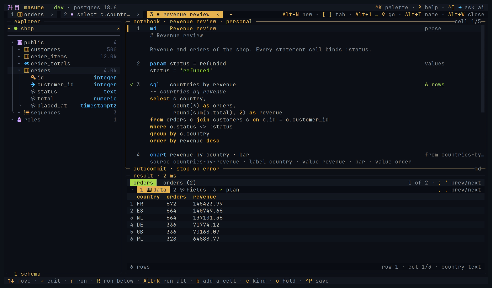

<h1 align="center">升目 masume</h1>

<h3 align="center">A database client for the terminal</h3>

<p align="center">
  <em>Browse and query databases in the terminal. Share selected connection profiles with an AI agent.</em>
</p>

<p align="center">
  <a href="https://github.com/turanmahmudov/masume/actions/workflows/check.yml"></a>
  
  
</p>

<p align="center">
  <code>mise use -g github:turanmahmudov/masume@latest</code>
</p>

<p align="center">
  
</p>

---

### Browse

The object tree lists database objects supported by the engine. Table views include data, columns, indexes, constraints, DDL and query plans.


### Diagram

An ER diagram shows a table and the tables it is linked to by foreign keys.


### Query

The editor has syntax highlighting and completion from the database catalog. Local checks and supported server checks mark detected errors before execution. A statement without a diagnostic can still fail.


### Results

Sort, filter, follow a foreign key, or freeze a column. Grid edits stay staged until SQL review and execution. Masking hides matching columns in the grid only; copies, exports and value viewers retain original values.


### Explain

Query plans are displayed as a tree, with estimated or measured costs.


### Notebooks

Cells of prose, values, statements and charts over one connection. Each cell keeps its own result and its own view. A notebook is a Markdown file, and `masume nb run` runs it without a screen.



### Agents

masume has a built-in AI chat and an MCP server over stdio. The AI chat uses the current connection and asks before each query, including reads. MCP opens separate connections to explicitly allowed profiles. MCP access levels and profile settings apply to its queries and write confirmations.

Both interfaces share database tools, but their policies differ. See [AI data sharing](docs/ai.md), [MCP access](docs/mcp.md), and [security limits](SECURITY.md).

---

## Features

**Multiple engines:** PostgreSQL, MySQL, SQL Server, ClickHouse, SQLite and MongoDB, plus hosted services based on them

**MCP server:** `masume --mcp` exposes selected profiles to an agent over stdio, with an access level per profile and for the whole server

**AI chat:** ask about a statement, its error, or its query plan. Supports Anthropic and OpenAI

**Catalog completion:** suggestions for table and column names, with best-effort statement diagnostics

**Table details:** data, columns, indexes, constraints, DDL, query plans and ER diagrams, subject to engine support

**Staged edits:** insert, edit, duplicate and delete supported table rows. Review SQL before execution. Sorting, server filtering and rerunning discard staged edits. See [editing rows](docs/usage.md#editing-rows).

**Filters:** server predicates and filters on loaded rows. See [sorting and filters](docs/usage.md#sorting-and-filters) for their different scopes.

**Foreign keys:** open rows matching the selected foreign-key column. Composite keys require additional filtering.

**Query plans** as a tree with estimated or measured costs, or as raw text

**SQL notebooks:** an ordered list of cells over one connection: prose, the values every cell binds, statements, and charts of what they answered. Each cell keeps its own result and its own view. A notebook is a Markdown file, and `masume nb run` runs one without a screen. See [notebooks](docs/notebooks.md).

**Named parameters:** a statement with `:name` placeholders opens a form for the values

**Server dashboard:** `Alt+O a` opens sessions and available metrics, refreshed about every two seconds. PostgreSQL panels include locks, load, cache hits, replication lag and statement statistics where supported. See [server activity](docs/usage.md#server-activity) for engine limits and session actions.

**MongoDB:** supported shell-style calls and extended JSON. This is a [subset of shell syntax](docs/engines.md#mongodb), not a JavaScript runtime.

**Export and copy:** CSV and JSON files. Clipboard formats also include Markdown, `INSERT` statements, row JSON and column `IN` clauses. See [copy and export](docs/usage.md#copy-and-export) for row scope and CSV transformations.

**Import:** CSV or JSON into an existing or new SQL table. A file picker, column mapping and local validation precede execution. Database constraints can still reject accepted rows. See [importing files](docs/usage.md#importing-files).

**Query history and saved queries.** Tab restoration retains query text and selected settings, but not result rows, staged edits or transactions.

**Project profiles and queries:** the nearest `.masume.toml` supplies shared connections and saved queries. User profiles replace project profiles with matching names.

**Write plans:** optional counts, assigned columns, trigger names and foreign-key effects for eligible single SQL writes. Plans can retain reverse SQL for captured target rows. Undo excludes cascades and trigger effects, and can overwrite later changes. See [write-plan limits](docs/configuration.md#measuring-a-write).

**Manual transactions:** explicit begin, commit and rollback, or automatic begin with autocommit disabled. Engine transaction restrictions still apply.

**Password sources:** prompts, the operating system keyring, environment variables, commands and named secret stores. masume ignores database passwords in profile files. AI API keys have separate storage rules. See [credentials](SECURITY.md#credentials).

**Read-only profiles:** client checks with additional engine-specific protection. MongoDB uses client checks only; explicit TiDB read-only profiles fail to connect. Database permissions remain essential.

**Seventeen built-in themes,** custom themes, or terminal colours. System-theme updates require terminal colour-query support.

**Optional AI chat:** `[ai] enabled = false` disables the AI chat and its interface elements. MCP settings are separate.

---

## Install

Each command below installs the latest tagged release. The packages and archives are on the [releases page](https://github.com/turanmahmudov/masume/releases/latest).

### Script

```sh
curl -fsSL https://raw.githubusercontent.com/turanmahmudov/masume/master/install.sh | sh
```

The script puts `masume` in `~/.local/bin`.

### mise

```sh
mise use -g github:turanmahmudov/masume@latest
```

### Debian and Ubuntu

```sh
sudo dpkg -i masume_0.0.4_linux_amd64.deb  # adapt the version and the architecture
```

### Fedora and RHEL

```sh
sudo rpm -i masume_0.0.4_linux_amd64.rpm  # adapt the version and the architecture
```

### Alpine

The packages are unsigned, so `apk` needs `--allow-untrusted`.

```sh
sudo apk add --allow-untrusted masume_0.0.4_linux_amd64.apk  # adapt the version and the architecture
```

### Archive

Unpack the `tar.gz` for the platform and put `masume` on the PATH.

### Go

```sh
go install github.com/turanmahmudov/masume@latest
```

Go 1.27 or later builds it from the module proxy.

### From source

```sh
git clone https://github.com/turanmahmudov/masume.git
cd masume
mise install
mise run install
```

## Usage

```text
masume                       open the client
masume run [TARGET] STATEMENT run statements and exit
masume URL                   open a supported connection URL
masume FILE                  open an existing SQLite file
masume DSN                   open a keyword connection string
masume --profile NAME        open a saved or project profile
masume --detect              offer detected container databases
masume --mcp                 serve allowed MCP profiles
masume --mcp --profile=NAME  serve one allowed MCP profile
masume --mcp --check         check enabled MCP profiles and exit
masume --version             print the version and exit
```

A command-line target needs no saved profile. Without an explicit target or profile, masume can open `$DATABASE_URL`.

```sh
masume 'postgres://reader@db.internal:5432/shop?sslmode=verify-full'
masume "host=db.internal dbname=shop user=reader"
masume ./notes.db
masume --profile shop-prod
masume --detect
```

`--detect` reads running containers through Docker, or Podman when Docker is absent. Supported database images with published ports appear in the picker. Connection fields come from container environment variables and detection defaults.

The client prompts when the connection requires a missing password. Temporary connections remain unsaved until requested. On exit, `y` saves opened temporary profiles and `n` exits without saving. Saving a retained password can store that password in the keyring.

Supported URLs are not complete native driver connection strings. Most native URL options are ignored. See [connection targets](docs/configuration.md#a-connection-on-the-command-line) before using authentication or TLS options.

The [user guide](docs/usage.md) covers navigation, SQL, editing, transactions, imports, exports, history and troubleshooting. The [notebook guide](docs/notebooks.md) covers cells, charts and `masume nb run`.

### Without a screen

`masume run` executes statements and writes results to stdout. It uses profiles, connection commands, timeouts and read-only checks, but not write confirmation, write plans or undo. Batches are not automatically atomic.

```sh
masume run -p shop-prod -f json 'select count(*) from orders'
masume run -p shop -e ./reports/daily.sql --param day=2026-09-02
masume run -p shop --explain 'select * from orders where status = :status' --param status=paid
masume run ./notes.db -f csv 'select * from notes limit 100000' > notes.csv
echo 'select 1' | masume run -p shop -e -
```

Formats are `table` by default, `csv`, `json` and `markdown`. Reads without their own limit return one profile page by default. `--limit` adds an output cap, including for statements with a SQL limit. Limited reads without `--limit` stream CSV and JSON in batches; table and Markdown output remain buffered.

`--explain` executes eligible reads to measure their plans. It is not a dry run. Exit `1` can follow a successful write with incomplete output; do not automatically retry writes. See [headless usage](docs/headless.md) for exit codes, credentials and output limits.

### For a team

A repository can contain `.masume.toml` with shared profiles and queries:

```toml
[profile.dev]
engine   = "postgres"
host     = "127.0.0.1"
database = "shop"
user     = "shop"
env      = "dev"

[query.recent-orders]
sql         = "select * from orders order by created_at desc limit 50"
description = "the newest 50 orders"
```

masume reads the nearest project file in or above the working directory. Profiles appear in the picker with a `project` label; queries appear under `Ctrl+Q`. A user profile replaces the whole project profile with the same name.

Project profiles with `password_command`, `password_env`, `command`, `secret` or `secret_ref` are refused. Literal `password` values are ignored instead. Both `auth = "prompt"` and `auth = "keyring"` work. Keyring access uses the profile name, so a project profile can access an existing password under that name.

Project files cannot set global themes, keys, AI providers or MCP settings. An allowed MCP name can still resolve to a project profile. See [project configuration](docs/configuration.md#the-project-file) and [project security](SECURITY.md#project-files).

The config file is `$XDG_CONFIG_HOME/masume/config.toml`. The history file is `$XDG_STATE_HOME/masume/history.sqlite`. See [docs/mcp.md](docs/mcp.md) for the MCP server.

## Status

The project is in an early stage. The config file format can change before `v1`. It builds on Linux and macOS, for amd64 and arm64.

Tier 1 engines have integration coverage in CI; SQLite uses temporary files. Tier 2 services share protocols but have no real-server integration coverage. See [engine limits](docs/engines.md) before production use.

## First connection

The quickest first connection is a URL on the command line:

```sh
masume postgres://ada@127.0.0.1:5432/shop
```

The first interactive run creates a starter configuration file if none exists. In the picker, `n` adds a profile. `Ctrl+N` returns to the picker from a connection. Profiles can also be written directly:

```toml
[profile.shop]
engine   = "postgres"
host     = "127.0.0.1"
port     = 5432
database = "shop"
user     = "ada"
auth     = "prompt"
env      = "dev"
mode     = "write"
```

`auth = "prompt"` asks for the password at connection time. The password stays in memory unless saved to the keyring.

## Docs

| Page | About |
| --- | --- |
| [User guide](docs/usage.md) | Workflows, navigation, editing, data transfer and troubleshooting |
| [Notebooks](docs/notebooks.md) | Cells, charts, run policy, the file format and `masume nb run` |
| [Configuration](docs/configuration.md) | Settings, defaults, profiles and password sources |
| [Engines](docs/engines.md) | Support tiers and capabilities |
| [Keys](docs/keys.md) | Default bindings, scopes and overrides |
| [Themes](docs/themes.md) | Built-in themes, and how to write a custom one |
| [AI chat](docs/ai.md) | Providers, tools, what is sent to the provider |
| [MCP server](docs/mcp.md) | Tools, limits, confirming a write |
| [Without a screen](docs/headless.md) | `masume run` for scripts and CI |
| [Architecture](docs/architecture.md) | How the source is organized |
| [Security](SECURITY.md) | Storage, data sharing and protection limits |

## Contributing

See [CONTRIBUTING.md](CONTRIBUTING.md).

## License

Apache License 2.0. See [LICENSE](LICENSE).
